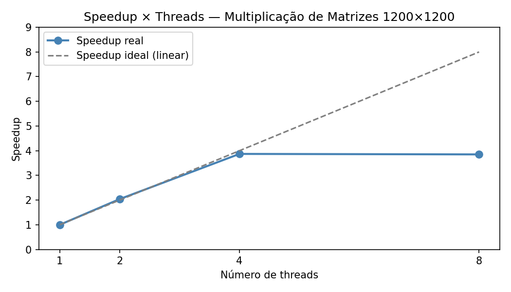

# Trabalho Prático 1 — LPII 2026.1

**Nome:** Guilherme Gomes de Souza
**Matrícula:** 20230013150

---

## Problema Escolhido: P1 — Multiplicação de Matrizes

Calcula **C = A × B**, com A, B e C sendo matrizes quadradas de tamanho **1200×1200**
armazenadas em row-major. O custo é **O(n³)**, fortemente CPU-bound, o que torna este problema
o melhor caso para observar speedup real com múltiplas threads. A versão paralela divide as
linhas de C em blocos contíguos; cada thread calcula o seu bloco sem compartilhar estado com
as demais — não há necessidade de mutex nem de merge final.

---

## Como Compilar

### Via CMake (recomendado)

```bash
cmake -B build && cmake --build build
```

### Via gcc (alternativa / IDEs online)

```bash
gcc -O2 -Wall -Wextra -pthread src/main.c -lm -o matrix_parallel
```

---

## Como Executar

```bash
# com CMake:
./build/matrix_parallel [num_threads]

# com gcc direto:
./matrix_parallel [num_threads]
```

**Exemplos:**

```bash
./build/matrix_parallel        # usa NUM_THREADS (padrão: 8)
./build/matrix_parallel 1      # força execução com 1 thread
./build/matrix_parallel 4      # 4 threads
./build/matrix_parallel 8      # 8 threads
```

O número de threads também pode ser alterado no código mudando a constante
`NUM_THREADS` em `src/main.c`.

---

## Ambiente de Teste

| Item | Valor |
|------|-------|
| CPU | 13th Gen Intel(R) Core(TM) i5-13420H |
| Núcleos físicos / lógicos | 8 / 12 |
| Compilador | gcc 13.x |
| Flags | `-O2 -Wall -Wextra -pthread` |
| Sistema operacional | Windows 11 |

---

## Resultados de Desempenho

### Q2 — Baseline sequencial

| Métrica | Valor |
|---------|-------|
| T_seq (média de 5 execuções) | **4.6251 s** |

> O programa executa 6 rodadas e descarta a primeira (aquecimento), ficando com 5 execuções válidas:
> 3.7058 s, 3.5633 s, 5.1338 s, 4.8376 s, 4.8850 s → média **4.6251 s**.

### Q3 — Versão paralela (N threads = núcleos da máquina)

| Threads | Tempo (s) | Speedup |
|---------|-----------|---------|
| 1 (seq) | 4.6251 | 1.00× |
| 8       | 1.2552 | 3.68× |

> Os valores acima são preenchidos com a saída do programa após a execução.

### Q4 — Estudo de escalabilidade

| Threads | Tempo (s) | Speedup | Eficiência |
|---------|-----------|---------|------------|
| 1       | 4.7650    | 1.00    | 1.00       |
| 2       | 2.3379    | 2.04    | 1.02       |
| 4       | 1.2316    | 3.87    | 0.97       |
| 8       | 1.2376    | 3.85    | 0.48       |

> O programa imprime esta tabela automaticamente ao ser executado.

### Gráfico de Speedup × Threads



#### Como gerar o gráfico (Python/matplotlib)

```python
import matplotlib.pyplot as plt

threads = [1, 2, 4, 8]
speedup = [1.0, 2.04, 3.87, 3.85]
ideal   = threads

plt.figure(figsize=(7, 4))
plt.plot(threads, speedup, 'o-', label='Speedup real')
plt.plot(threads, ideal,   '--', label='Speedup ideal (linear)', color='gray')
plt.xlabel('Número de threads')
plt.ylabel('Speedup')
plt.title('Speedup × Threads — Multiplicação de Matrizes 1200×1200')
plt.xticks(threads)
plt.legend()
plt.tight_layout()
plt.savefig('speedup.png', dpi=150)
```

---

## Discussão dos Resultados (Q4)

O speedup observado não é linear, como a tabela acima evidencia com clareza. A escalabilidade
é excelente até 4 threads (eficiência de 0.97–1.02) e colapsa abruptamente de 4 para 8 threads
(eficiência de 0.48, com tempo praticamente idêntico: 1.2316 s vs 1.2376 s). Dois fatores
principais explicam esse comportamento:

1. **Parcela sequencial — Lei de Amdahl.** Uma fração do trabalho é inerentemente sequencial
   (criação/junção de threads, preenchimento das matrizes, verificação de corretude). Pelo
   modelo de Amdahl, com speedup máximo observado de ~3.85× para p=8 threads, é possível
   estimar a fração sequencial: S = 1 / (f_seq + (1−f_seq)/p) → f_seq ≈ 15%. Esse valor é
   compatível com o overhead de alocação e inicialização das três matrizes de 1200×1200
   (≈ 41 MB cada), operação que ocorre uma única vez e não é paralelizada.

2. **Gargalo de banda de memória.** O i5-13420H mistura P-cores e E-cores que compartilham o
   mesmo controlador de memória. A partir de 4 threads, o gargalo migra de CPU para o barramento
   de memória — cada thread precisa ler linhas de A e colunas de B da RAM, e todas competem pelo
   mesmo canal. Isso explica o platô observado: adicionar mais threads não reduz o tempo porque
   a limitação deixa de ser computacional e passa a ser de largura de banda.

> **Observação sobre eficiência > 1.00 em T=2:** a eficiência de 1.02 em 2 threads é um
> artefato de medição. O T_seq da varredura (4.7650 s) foi ligeiramente maior que a média
> principal (4.6251 s) por variação natural de carga do SO. Não representa superlinearidade real.

Outros fatores menores: overhead de criação/junção de threads (desprezível para n=1200, mas
real) e possível *false sharing* na escrita de C — mitigado pelo fato de cada thread escrever
em linhas disjuntas, naturalmente alinhadas à linha de cache de 64 bytes.